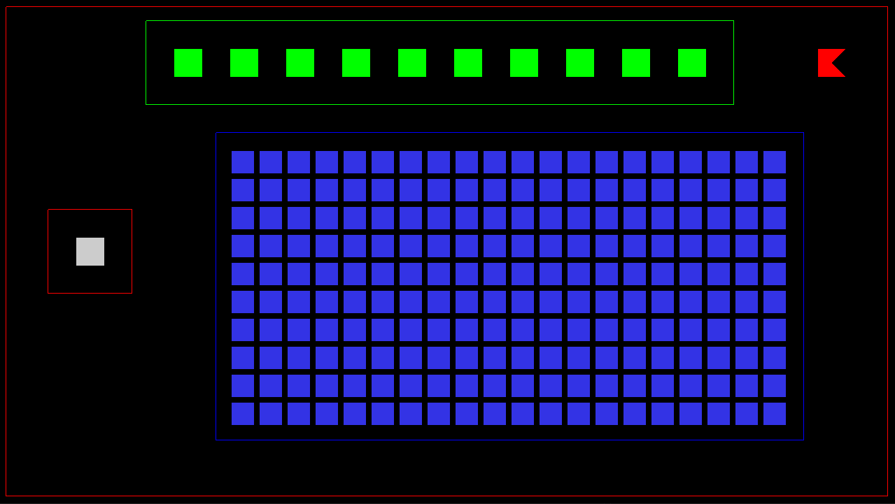
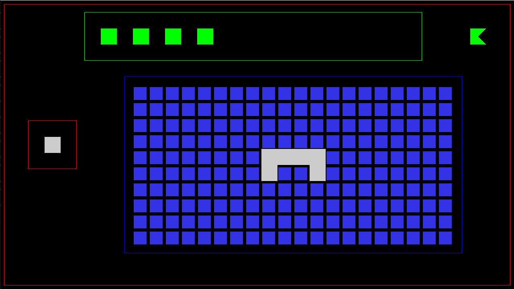
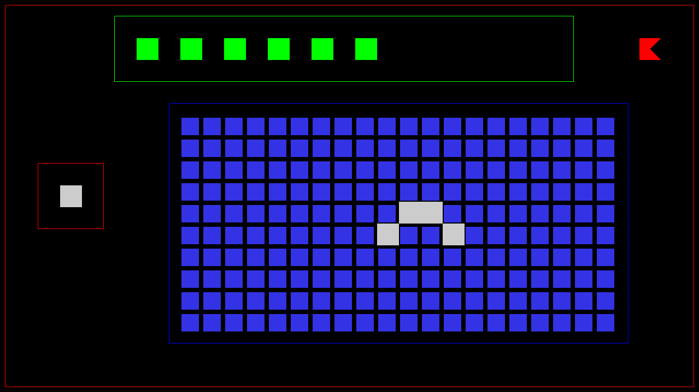
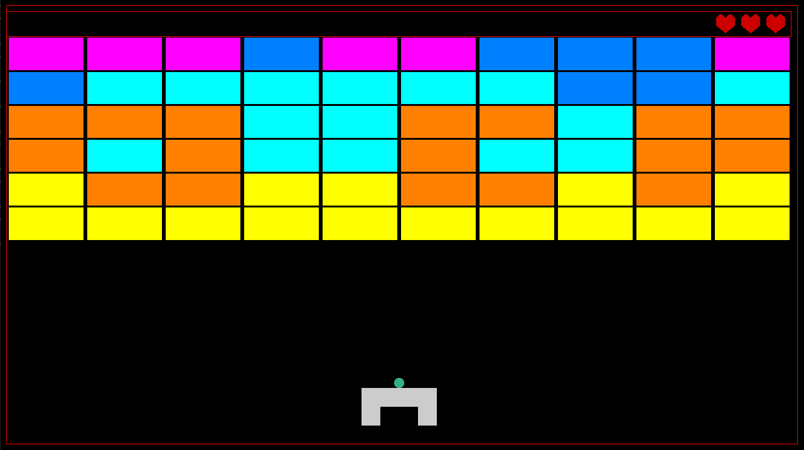
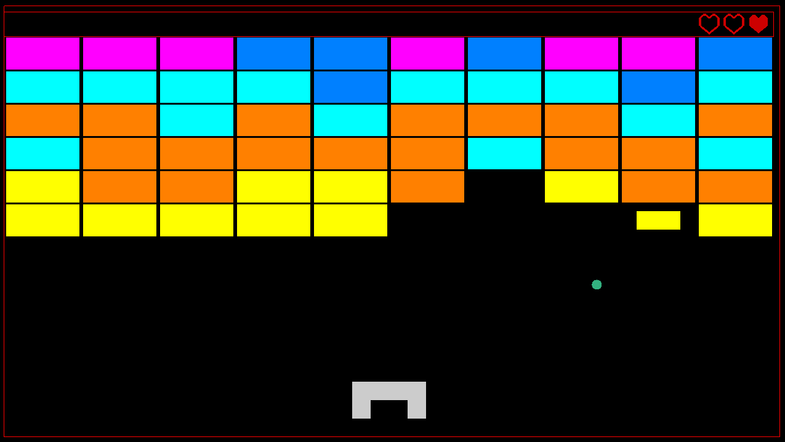

# Breakout Game: Spacecraft Editor & Gameplay

Author: Mara Gheorghe, Politehnica University of Bucharest

This game is a modern take on the classic arcade game Breakout featuring a custom Spacecraft Editor.

*This project requires the [GFX Framework](https://github.com/UPB-Graphics/gfx-framework) provided by the Computer Graphics Department at the University. All source files are part of the framework except for those in the `Breakout` folder. Folow the instructions in the framework repository to run the game.*

---

## Space ship Editor

Before the game begins, the player must design their own space ship using a dedicated editor. The ship represents a box used to bounce the ball during the actual game. Once the game ends, the player is returned to the editor screen and can resume building the ship from where they left it.

### Editor Constraints

The Start Button remains red until all the following constraints are met, at which point it turns green and the game can start:

* **Correct Size:** The vehicle must have at least 1 and no more than 10 blocks. The top bar of green squares indicates how many blocks can still be used.
* **Connectivity:** The ship must be a single connected piece - horizontal or vertical neighbors, blocks placed in a diagonal do not count.

### Interaction

* **Drag & Drop:** Click and hold a block from the left panel to "carry" it with the cursor onto the grid in the middle. Release the left mouse button over a grid cell to place it.
* **Removal:** Right-click an existing block on the grid to delete it. This will also update the top row of squares.

---

## Breakout Gameplay

Once a proper ship is built and the start button pressed, the game arena is spawned. The ball sits on top of the ship, but it does not start moving untill `space` is pressed. The purpose of the game is to destroy all bricks in the upper part of the screen by having the ball hit them. 

### Core Mechanics

* **Lives:** The player starts with 3 lives, shown by the 3 full hearts on the top right side of the screen. Once the ball falls to the bottom part of the game area, a life is lost, and one of the hearts becomes hollow.

* **Ship Control:** The ship can be moved using the Left and Right arrow keys.

* **Collisions:** * The ball is circular; the ship is simplified to a rectangle, more specifically an **AABB (Axis-Aligned Bounding Box)**.

* **Ball-Paddle:** Hitting the top of the ship changes the ball's direction based on the contact point, allowing for tactical aiming.

### Advanced Features

* **Destruction Animation:** When destroyed, bricks quickly shrink until they disappear. Shrinking bricks do not collide with the ball.

* **Brick Durability:** Some bricks are reinforced and require multiple hits to break. Their color changes to indicate the remaining durability of the brick each time it is hit. Brick durabilities are randomly generated at the start of the game, however the top rows will always have more durable bricks. 

---

## Technical Challenges Highlights

* **Dimensions:** With so many objects in both the editor and the game, having set sizes for each of them was out of the question. Instead, a universal default block size was implemented, named `unit`. Each object's size is defined based on this unit: a building block is 1x1 unit, an empty grid block is 0.8x0.8 etc. A quick change in code can resize everything (even relative to the resolution), while all proportions remain the same.

* **Ship translation from editor to game:** The ship is not actually created as a stand-alone object untill the game starts. If a block is placed or removed, all that happens is a change of value in the editor grid matrix, which is a lot less taxing than creating or modifying a complete mesh.

* **Ball sticking:**  Simply changing the direction of the ball when it hits a surface proved insufficient; Depending on the timing, the program would register the ball's centre as being past the surface, which resulted in the ball becoming stuck to that surface, instead of bouncing off it. That was fixed by having the ball be teleported right next to the surface before continuing its movement. It is imperceptible to the human eye, but it makes sure the ball never remains stuck to a wall, brick or the ship itself

## Screenshots

1. The ship editor with an empty grid

2. The ship editor with a valid ship construction made of 6 blocks. The start button has turned green and can now be pressed

3. The ship editor with an invalid ship construction, after 2 blocks were removed from the previous construction

4. A Breakout game, right before starting

5. A different Breakout game, with its unique brick durability layout, that has already begun. The player has lost 2 lives already and the brick they've just hit is in the process of shrinking
